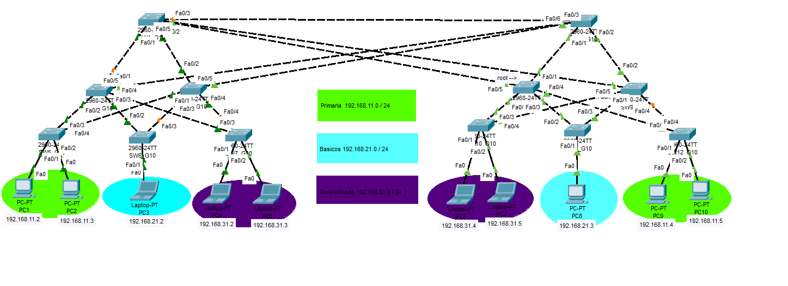

# MANUAL TÉCNICO
## Topología de Red


## Configuraciones realizadas
### Configuración de Nombres y Passwords
```
enable
configure terminal
hostname SW1_G10
banner motd $ Bienvenido switch servidor grupo 10 $
line console 0
password redes2grupo10
login
exit
```

### Configuración de VLANs
| Nombre | VLAN | IP | Máscara de Subred |
|:----:|:----:|:----:|:----:|
| Primaria | 11 | 192.168.11.0 | 255.255.255.0 |
| Basicos | 21 | 192.168.21.0  | 255.255.255.0 |
| Diversificado | 31 | 192.168.31.0  | 255.255.255.0 |

#### Comandos
```
enable configure terminal
vlan 11
name Primaria
vlan 21
name Basicos
vlan 31
name Diversificado
exit
interface vlan 11
ip address 192.168.11.0 255.255.255.0
no shutdown
interface vlan 21
ip address 192.168.21.0 255.255.255.0
no shutdown
interface vlan 31
ip address 192.168.31.0 255.255.255.0
no shutdown
exit
```

### Configuración VTP
#### Comandos Switch modo Server
```
enable
configure terminal
vtp mode server
vtp domain g10
vtp password redes2grupo10
```
#### Comandos Switch modo Client
```
enable
configure terminal
vtp mode client
vtp domain g10
vtp password redes2grupo10
```

### Configuración Puertos modo Troncal
#### Tabla de puertos
| Switch | Puertos | 
|:----:|:----:|
| SW1 | f0/1-5 | 
| SW2 | f0/1-3, f0/5-6 |
| SW3 | f0/1-5 | 
| SW4 | f0/1-5 | 
| SW5 | f0/3-4 |
| SW6 | f0/2-3 | 
| SW7 | f0/3-4 | 
| SW8 | f0/1-5 |
| SW9 | f0/1-5 | 
| SW10 | f0/3-4 | 
| SW11 | f0/2-3 |
| SW12 | f0/3-4 | 

#### Comandos
```
enable
configure terminal
interface range f0/1-5
switchport mode trunk
switchport trunk nonegotiate
switchport trunk allowed vlan 11,21,31
exit
``` 

### Configuración Puertos modo Acceso
#### Tabla de Puertos
| Switch | Puerto | Vlan | Nombre Vlan |
|:----:|:----:| :----:|:----:|
| SW5 | f0/1-2 | 11 | Primaria |
| SW6 | f0/1 | 21 | Basicos |
| SW7 | f0/1-2 | 31 | Diversificado |
| SW10 | f0/1-2 | 31 | Diversificado |
| SW11 | f0/1 | 21 | Basicos |
| SW12 | f0/1-2 | 11 | Primaria |


#### Comandos
```
enable
configure terminal
interface range f0/1-2
switchport mode access
switchport access vlan 11

!Port-security:
interface range FastEthernet0/1-2
switchport port-security maximum 1
switchport port-security violation shutdown
interface FastEthernet0/1
switchport port-security mac-address 0060.70E3.8B25
interface FastEthernet0/2
switchport port-security mac-address 0007.EC1D.751B
exit
```

### PVST
```
spanning-tree mode pvst
```

### RSTP
```
spanning-tree mode rapid-pvst
```
### Configuración de PCs
#### Tabla de IPs
| PC | IP | Máscara de Subred | VLAN |
|:----:|:----:|:----:|:----:|
| PC1 | 192.168.11.2 | 255.255.255.0 | Primaria | 
| PC2 | 192.168.11.3 | 255.255.255.0 | Primaria |
| PC3 | 192.168.21.2 | 255.255.255.0 | Basicos |
| PC4 | 192.168.31.2 | 255.255.255.0 | Diversificado |
| PC5 | 192.168.31.3 | 255.255.255.0 | Diversificado |
| PC6 | 192.168.31.4 | 255.255.255.0 | Diversificado |
| PC7 | 192.168.31.5 | 255.255.255.0 | Diversificado |
| PC8 | 192.168.21.3 | 255.255.255.0 | Basicos |
| PC9 | 192.168.11.4 | 255.255.255.0 | Primaria |
| PC10 | 192.168.11.5 | 255.255.255.0 | Primaria |


## Pruebas de Convergencia de STP

### Tabla comparativa de tiempos de convergencia

| Escenario | Protocolo STP | Red Primaria | Red Basicos | Red Diversificado |
|:-----------:|:-----------:|:-----------:|:-----------:|:-----------:|
| 1         | PVST           | 59.77 segundos | 59.17 segundos | 59.99 segundos |
| 2         | Rapid PVST     | 43.52 segundos | 0 segundos | 8.37 segundos |


### Protocolo PVST

#### VLAN Primaria
- Ping desde 192.168.11.5 hasta 192.168.11.2
- En el switch root se desactiva la interfaz 0/1
- El protocolo tarda en restaurar la conexión 59.77 segundos

#### VLAN Basicos
- Ping desde 192.168.21.3 hasta 192.168.21.2
- En el switch root se desactiva la interfaz 0/1
- El protocolo tarda en restaurar la conexión 59.17 segundo

#### VLAN Diversificado
- Ping desde 192.168.31.5 hasta 192.168.31.2
- En el switch root se desactiva la interfaz 0/1
- El protocolo tarda en restaurar la conexión 59.19 segundos

### Protocolo Rapid PVST

#### VLAN Primaria
- Ping desde 192.168.11.5 hasta 192.168.11.2
- En el switch root se desactiva la interfaz 0/1
- El protocolo tarda en restaurar la conexión 43.52 segundos

#### VLAN Basicos
- Ping desde 192.168.21.3 hasta 192.168.21.2
- En el switch root se desactiva la interfaz 0/1
- El protocolo tarda en restaurar la conexión 0 segundos

#### VLAN Diversificado
- Ping desde 192.168.31.5 hasta 192.168.31.2
- En el switch root se desactiva la interfaz 0/1
- El protocolo tarda en restaurar la conexión 8.37 segundos

### Conclusión:
El mejor escenario es cuando se elige el protocolo **Rápido PVST** porque los tiempos de convergencia son mucho más rápidos, y de esta forma se evita la pérdida de paquetes en las comunicaciones.
