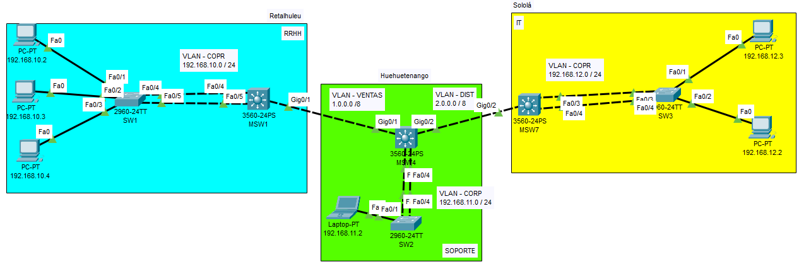

# MANUAL TÉCNICO
## Topología de Red


## Configuraciones realizadas
### Configuración de PCs
| Sucursal | IP | Máscara de Subred | Gateway |
|:----:|:----:|:----:|:----:|
| Retalhuleu | 192.168.10.2 | 255.255.255.0 | 192.168.10.1| 
| Retalhuleu | 192.168.10.3 | 255.255.255.0 | 192.168.10.1 |
| Retalhuleu | 192.168.10.4 | 255.255.255.0 | 192.168.10.1 |
| Huehuetenango | 192.168.11.2 | 255.255.255.0 | 192.168.11.1 |
| Sololá | 192.168.12.2 | 255.255.255.0 | 192.168.12.1 |
| Sololá | 192.168.12.3 | 255.255.255.0 | 192.168.12.1 |


### Configuración de VLANs
| Nombre | VLAN | IP | Máscara de Subred |
|:----:|:----:|:----:|:----:|
| CORPORATIVO61 | 61 | 192.168.10.0 | 255.255.255.0 |
| CORPORATIVO61 | 61 | 192.168.11.0 | 255.255.255.0 |
| CORPORATIVO61 | 61 | 192.168.12.0 | 255.255.255.0 |
| VENTAS11 | 11 | 1.0.0.0 | 255.0.0.0 |
| DISTRIBUCION21 | 21 | 2.0.0.0  | 255.0.0.0 |

#### Comandos

- RRHH
```
enable
configure terminal
vlan 11
name VENTAS11
vlan 61
name CORPORATIVO61
exit
interface vlan 11
ip address 1.0.0.1 255.0.0.0
no shutdown
interface vlan 61
ip address 192.168.10.1 255.255.255.0
no shutdown
exit
```

- Soporte
```
enable 
configure terminal
vlan 11
name VENTAS11
vlan 21
name DISTRIBUCION21
vlan 61
name CORPORATIVO61
exit
interface vlan 11
ip address 1.0.0.2 255.0.0.0
no shutdown
interface vlan 21
ip address 2.0.0.1 255.0.0.0
no shutdown
interface vlan 61
ip address 192.168.11.1 255.255.255.0
no shutdown
exit
```

- IT
```
enable 
configure terminal
vlan 21
name DISTRIBUCION21
vlan 61
name CORPORATIVO61
exit
interface vlan 21
ip address 2.0.0.2 255.0.0.0
no shutdown
interface vlan 61
ip address 192.168.12.1 255.255.255.0
no shutdown
exit
```

### Configuración LACP
#### RRHH
- SW1
```
configure terminal
interface range f0/4-5
channel-group 1 mode active
no shutdown
```
- MSW1
```
configure terminal
interface range f0/4-5
channel-group 1 mode passive
no shutdown
```
#### Soporte
- SW2
```
configure terminal
interface range f0/3-4
channel-group 2 mode active
no shutdown
```
- MSW4
```
configure terminal
interface range f0/3-4
channel-group 2 mode passive
no shutdown
```
#### IT
- SW3
```
configure terminal
interface range f0/3-4
channel-group 3 mode active
no shutdown
```
- MSW7
```
configure terminal
interface range f0/3-4
channel-group 3 mode passive
no shutdown
```
### Configuración EIGRP
#### Retalhuleu - Huehuetenango
- MSW1
```
configure terminal
router eigrp 10
network 192.168.10.0 0.0.0.255
network 192.168.11.0 0.0.0.255
network 1.0.0.0 0.255.255.255
no auto-summary
```
- MSW4
```
configure terminal
router eigrp 10
network 192.168.10.0 0.0.0.255
network 192.168.11.0 0.0.0.255
network 1.0.0.0 0.255.255.255
no auto-summary
```
### Configuración OSPF
#### Huehuetenango - Sololá
- MSW4
```
configure terminal
router ospf 12
network 192.168.11.0 0.0.0.255 area 12
network 192.168.12.0 0.0.0.255 area 12
network 2.0.0.0 0.255.255.255 area 12
``` 
- MSW7
```
configure terminal
router ospf 12
network 192.168.12.0 0.0.0.255 area 12
network 192.168.11.0 0.0.0.255 area 12
network 2.0.0.0 0.255.255.255 area 12
``` 