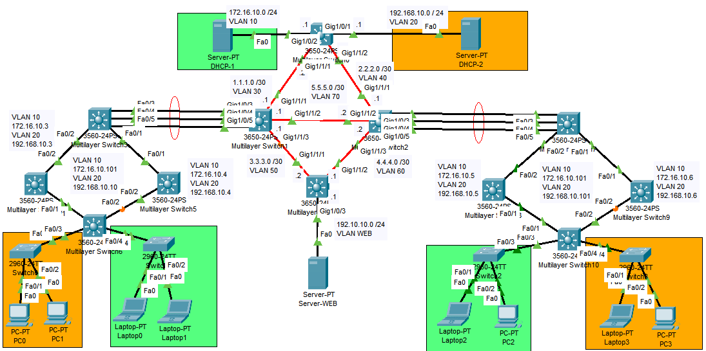

# MANUAL TÉCNICO
## Topología de Red


## Configuraciones realizadas
### Configuración LACP
#### Edificio 1
- MSW3
```
configure terminal
interface range f0/3-5
channel-group 1 mode active
no shutdown
```
- MSW1
```
configure terminal
interface range g1/0/3-5
channel-group 1 mode passive
no shutdown
```
#### Edificio 2
- MSW2
```
configure terminal
interface range f0/3-5
channel-group 2 mode active
no shutdown
```
- MSW7
```
configure terminal
interface range g1/0/3-5
channel-group 2 mode passive
no shutdown
```
### Configuración EIGRP
- MSW0
```
configure terminal
router eigrp 10
network 3.3.3.0 0.0.0.3
network 4.4.4.0 0.0.0.3
network 5.5.5.0 0.0.0.3
network 1.1.1.0 0.0.0.3
network 2.2.2.0 0.0.0.3
network 172.16.10.0 0.0.0.255
network 192.168.10.0 0.0.0.255
```

- MSW1
```
configure terminal
router eigrp 10
network 2.2.2.0 0.0.0.3
network 4.4.4.0 0.0.0.3
network 1.1.1.0 0.0.0.3
network 3.3.3.0 0.0.0.3
network 5.5.5.0 0.0.0.3
```

- MSW2
```
configure terminal
router eigrp 10
network 1.1.1.0 0.0.0.3
network 3.3.3.0 0.0.0.3
network 2.2.2.0 0.0.0.3
network 4.4.4.0 0.0.0.3
network 5.5.5.0 0.0.0.3
```

- MSW11
```
configure terminal
router eigrp 10
network 1.1.1.0 0.0.0.3
network 2.2.2.0 0.0.0.3
network 5.5.5.0 0.0.0.3
network 3.3.3.0 0.0.0.3
network 4.4.4.0 0.0.0.3
network 192.10.10.0 0.0.0.255
```

### Configuración HSRP

- MSW4
```
configure terminal
interface vlan 10
ip address 172.16.10.3 255.255.255.0
standby 10 ip 172.16.10.101
standby 10 priority 110
standby 10 preempt

interface vlan 20
ip address 192.168.10.3 255.255.255.0
standby 10 ip 192.168.10.101
standby 10 priority 110
standby 10 preempt
```

- MSW5
```
configure terminal
interface vlan 10
ip address 172.16.10.4 255.255.255.0
standby 10 ip 172.16.10.101

interface vlan 20
ip address 192.168.10.4 255.255.255.0
standby 10 ip 192.168.10.101
```

- MSW8
```
configure terminal
interface vlan 10
ip address 172.16.10.5 255.255.255.0
standby 20 ip 172.16.10.102
standby 20 priority 110
standby 20 preempt

interface vlan 20
ip address 192.168.10.5 255.255.255.0
standby 20 ip 192.168.10.102
standby 20 priority 110
standby 20 preempt
```

- MSW9
```
configure terminal
interface vlan 10
ip address 172.16.10.6 255.255.255.0
standby 20 ip 172.16.10.102

interface vlan 20
ip address 192.168.10.6 255.255.255.0
standby 20 ip 192.168.10.102
```

### Configuración Trunk y Access
| Switch | Puertos | Modo | 
|:----:|:----:|:----:|
| MSW0 | GigabitEthernet 1/1/1-2 | Trunk |
| MSW0 | GigabitEthernet 1/0/1-2 | Access |
| MSW1 | GigabitEthernet 1/1/1-3 | Trunk |
| MSW1 | GigabitEthernet 1/0/3-5 | Trunk  |
| MSW2 | GigabitEthernet 1/1/1-3 | Trunk |
| MSW2 | GigabitEthernet 1/0/3-5 | Trunk  |
| MSW3 | FastEthernet 0/1-5 | Trunk |
| MSW4 | FastEthernet 0/1-2 | Trunk |
| MSW5 | FastEthernet 0/1-2  | Trunk |
| MSW6 | FastEthernet 0/1-4 | Trunk |
| MSW7 | FastEthernet 0/1-5  | Trunk |
| MSW8 | FastEthernet 0/1-2 | Trunk |
| MSW9 | FastEthernet 0/1-2 | Trunk |
| MSW10 | FastEthernet 0/1-4 | Trunk |
| MSW11 | GigabitEthernet 1/1/1-2 | Trunk |
| MSW11 | GigabitEthernet 1/0/3 | Access |
| SW0 | FastEthernet 0/3  | Trunk |
| SW0 | FastEthernet 0/1-2  | Access |
| SW1 | FastEthernet 0/4  | Trunk |
| SW1 | FastEthernet 0/1-2  | Access |
| SW2 | FastEthernet 0/3  | Trunk |
| SW2 | FastEthernet 0/1-2  | Access |
| SW3 | FastEthernet 0/4  | Trunk |
| SW3 | FastEthernet 0/1-2  | Access |

En cada switch se configuraron los puertos de acuerdo a la tabla anterior:
- MSW0
```
! Trunk
interface range GigabitEthernet1/1/1-2
switchport mode trunk

! Access
interface range GigabitEthernet1/0/1-2
switchport mode access
```

- MSW1
```
! Trunk
interface range GigabitEthernet1/1/1-3
switchport mode trunk

! Access
interface range GigabitEthernet1/0/3-5
switchport mode access
```

- MSW2
```
! Trunk
interface range GigabitEthernet1/1/1-3
switchport mode trunk

! Access
interface range GigabitEthernet1/0/3-5
switchport mode access
```

- MSW3
```
! Trunk
interface range FastEthernet0/1-5
switchport trunk encapsulation dot1q
switchport mode trunk
```

- MSW4
```
! Trunk
interface range FastEthernet0/1-2
switchport trunk encapsulation dot1q
switchport mode trunk
```

- MSW5
```
! Trunk
interface range FastEthernet0/1-2
switchport trunk encapsulation dot1q
switchport mode trunk
```

- MSW6
```
! Trunk
interface range FastEthernet0/1-4
switchport trunk encapsulation dot1q
switchport mode trunk
```

- MSW7
```
! Trunk
interface range FastEthernet0/1-5
switchport trunk encapsulation dot1q
switchport mode trunk
```

- MSW8
```
! Trunk
interface range FastEthernet0/1-2
switchport trunk encapsulation dot1q
switchport mode trunk
```

- MSW9
```
! Trunk
interface range FastEthernet0/1-2
switchport trunk encapsulation dot1q
switchport mode trunk
```

- MSW10
```
! Trunk
interface range FastEthernet0/1-4
switchport trunk encapsulation dot1q
switchport mode trunk
```

- MSW11
```
! Trunk
interface range GigabitEthernet1/1/1-2
switchport mode trunk

! Access
interface range GigabitEthernet1/0/3
switchport mode access
```

- SW0
```
! Trunk
interface FastEthernet0/3
switchport mode trunk

! Access
interface FastEthernet0/1-2
switchport mode access
```

- SW1
```
! Trunk
interface FastEthernet0/4
switchport mode trunk

! Access
interface FastEthernet0/1-2
switchport mode access
```

- SW2
```
! Trunk
interface FastEthernet0/3
switchport mode trunk

! Access
interface FastEthernet0/1-2
switchport mode access
```

- SW3
```
! Trunk
interface FastEthernet0/4
switchport mode trunk

! Access
interface FastEthernet0/1-2
switchport mode access
```
